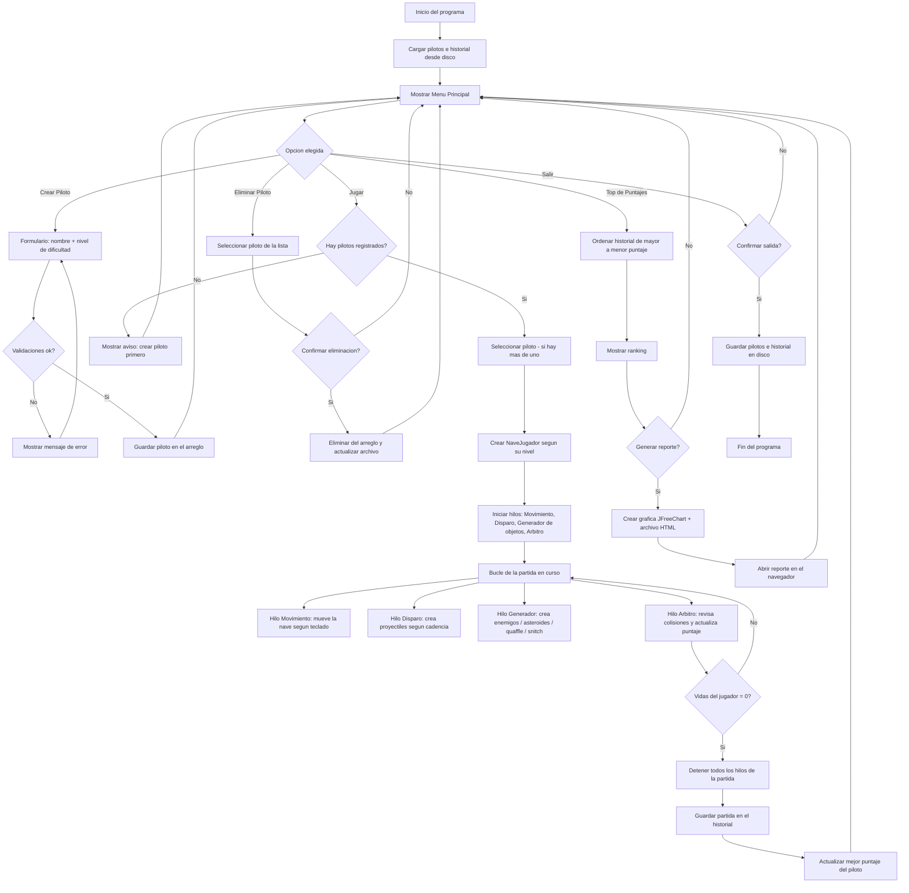

# Diagrama de Flujo — Quetzal Space Defender: Side Scroller

Representación gráfica del funcionamiento general del sistema, desde que
inicia el programa hasta que se cierra. El diagrama está escrito en
**Mermaid**, que GitHub renderiza automáticamente al ver este archivo en
el repositorio.

## Notas sobre el diagrama

- El bloque **K** (bucle de la partida) representa los 4 hilos que corren
  de forma simultánea e independiente mientras la partida está en curso:
  movimiento de la nave, disparo, generación de objetos y arbitraje de
  colisiones. Además, cada objeto generado (enemigo, asteroide, quaffle,
  snitch) y cada proyectil disparado lanza su propio hilo adicional de
  movimiento, no representado individualmente en el diagrama por
  simplicidad.
- El `Arbitro` es el único punto donde se decide si la partida continúa o
  termina (cuando las vidas del jugador llegan a 0).
